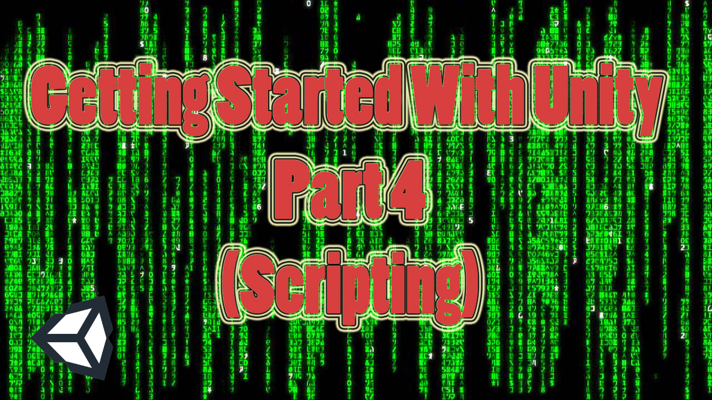
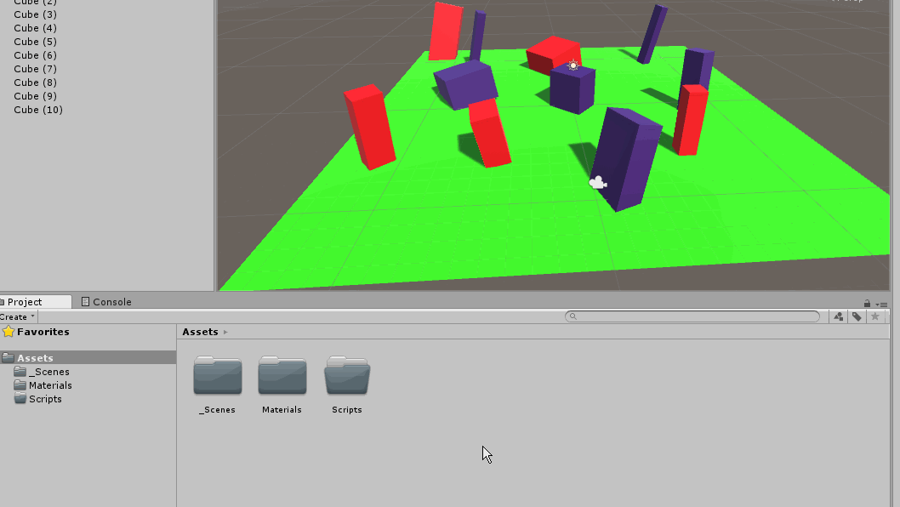
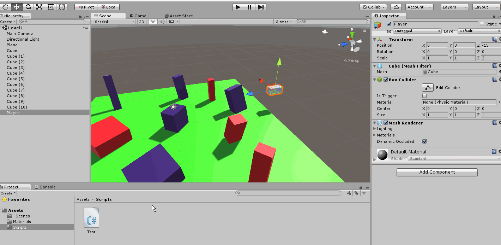
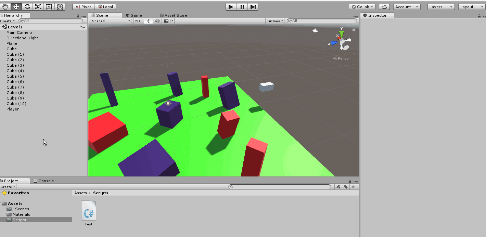
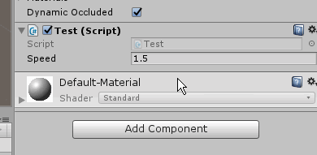
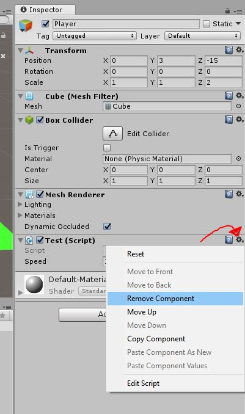
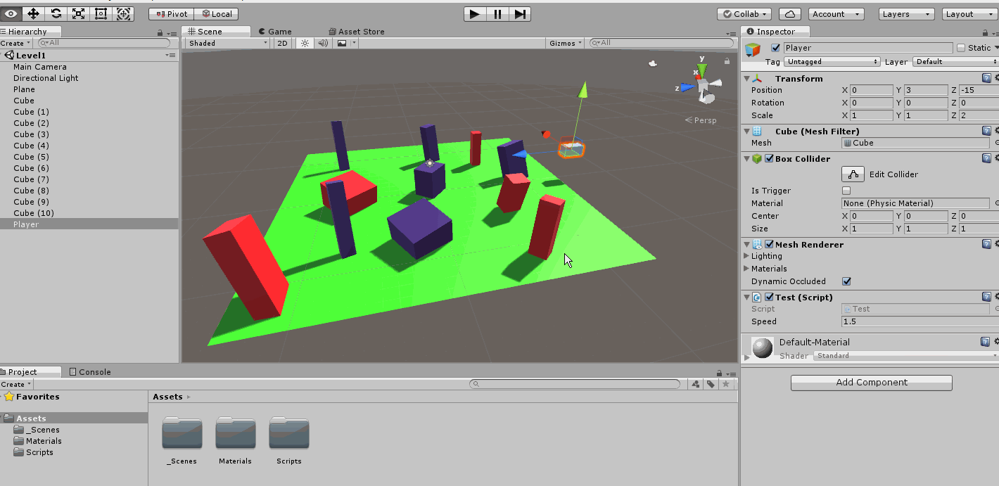

# Getting Started With Unity (Part 4 Scripting)



This will be the last tutorial of **Getting started with Unity** and it will be about scripting in Unity. If you haven't read the previous parts, make sure you do from the links in the reference section at the end.

## Overview

We will be coding using **C#** and **Visual Studio**. But first, we will setup our preference with the IDE of our choice which in our case is **Visual Studio**. We will later understand what is a **componenet** and write a simple script that moves the attached object based on player input.


*End result*

## Organization and Setting Preference

In any empty project created, It is good to keep things organized for you and for others working with you. Usually, the main folders are

* **_Scenes** (The *underscore* is to keep the folder always at the top to easily find it)
* **Materials**
* **Scripts**

There are some other important folders as well but we don't need them here like

* **Sound**
* **Models**
* **Textures/Sprites**
* **Prefabs**


*Folders Organized*

Now put the **Level1** scene we created earlier in the **_Scenes** folder and you are good to go.

For the preference, go to **Edit** > **Preferences**

*Setting*

A small window will pop up. From there, go to **External Tools** and open the drop down of **External Script Editor** and choose the IDE you want. If it's not there, click the browse option and navigate for the *.exe* file. Also, ignore the SDK and JDK for now, they are only needed for Android build which will have it's separate tutorial.


*Pereference*

## Everything is a component

Before diving in deep, you need to understand that Unity uses entity component system to create it's **GameObject**. This means all **GameObjects** are containers for components which can be attached to give it its behavior and properties. For example the **Transform** that comes by default with any GameObject. There are other stuff too like **Box Colliders**, **Rigidbodies**, etc...

The script that we write is considered a behavioral component. That's because we are specifying certain behavior writing that script. It is a good practice to split your script to multiple behaviors and use them as modular puzzle pieces. For example, **Movment** and **DieAfterCollision**. I see these are 2 different puzzle pieces. If you want an object to move, add the **Movement** behaviour/script to it and same thing if you want it to kill it after collision.

## Script

Now that we are organized and have chosen our favorite IDE, let's create our script. There are various ways of creating scripts, we will mention each when times come. The first way is by **Right click** in project tab, then **Create** > **C# Script**. It is extremely important to name it once you create it as we will discuss now.

Go to the **Scripts** folder and create a new script and name it anything. I named mine **Test**


*Script creation*

You will notice the inspector changed with the content of the script. Double click the script to open it in your favorite IDE. This is what you will be welcomed with.


*Test script*

Notice clearly the name of the class **Test** matches the name of the script **Test.cs**

``` C#
Public class Test : Monobehavior
```

If they didn't match, the script won't work and you won't be able to attach it to anything until you fix it. Either change the class name or the script name. That's why it is important to name the script after creating it and avoid renaming it.

The created class derives from **Monobehavior** which allows the script to run in the game loop. It gives the script also the ability to listen to certain events like:

* **Start** : That run only once at the beginning
* **Update** : That runs every frame (where game logic would be)
* **On Collision Enter**: That gets called once a collision happen (but a collider and a rigidbody components are needed)

You can check the full list in [Unity's documentation](https://docs.unity3d.com/ScriptReference/MonoBehaviour.html)

Add this line of code 

``` C#
public float speed = 1.5f;
```


*Float speed*

The good thing about Unity is that the public variables are editable in the inspector and you can tweak it in the editor without returning back to the script every time. Any floating point ends with **f**.

Now add this to your **Update** function

``` C#
transform.Translate(new Vector3(Input.GetAxis("Horizontal"), 0, Input.GetAxis("Vertical")) * speed * Time.deltaTime);
```


*Update*

Now, what does this code does?
let's break it down a bit:

``` C#
transform.Translate
```

This is a built in function that access the **Transform** component of the **GameObject** that this script is attached to. The capital **T Transform** is the class itself while the **t Transform** is the transform of the object that is attached to the script.

There are various functions in the **Transform** class like

* Translate
* Rotate
* LookAt

And a lot more. You can check them in the [Unity's Documentation](https://docs.unity3d.com/ScriptReference/Transform.html)

The translate functions takes a **Vector3** which is simply a vector in 3D space. A x,y and z coordinates.

We can look at this line of code as:

``` C#
transform.Translate(DirectionVector * speed * Time.deltaTime);
```

We want to move on the X-axis when we press (left or right) and move on Z-axis when we press (up and down). The Input.GetAxis function is a built in function that returns a value of an axis between -1 and 1 and can be mapped to joystick buttons [(Check documentation)](https://docs.unity3d.com/ScriptReference/Input.GetAxis.html). The **Horizontal** is mapped to the left,right and A,D keys while the **Vertical** is mapped to up,down and W,S keys.

You can edit and add new axes from **Edit**>**Project Settings**>**Input**


*Custom Axes*

Finally the **Time.deltaTime** is to make the speed frame independent. As we know, the **Update** function run 60 frames per seconds. On a very fast machines, it could be 90FPS. On mobile devices, it might be 30 FPS. To make our speed frame independent, we multiply our speed by **Time.deltaTime**

## Assign Script

First of all, go to your scene and 

* Set the camera position (0,11,-22)
* Set the rotation to (-30,0,0)
* Set the Scale to (1,1,1).


*Camera transform*

Now, create a new a new cube give it a name, I called it **Player** and

* Set the Position (0,3,-15)
* Set the Rotation to (0,0,0).
* Set the Scale to (1,1,2).


*Player transform*

Let's assign your script to it. There are many ways to assign the script

* **Drag and drop in Inspector, Hierarchy or Scene**

*Drag and drop*

* **Add Componenet** button in Inspector
You can create a script by pressed AddComponenet button and wirting down the name of the new **C#** script, or you can add an existing script by writing the name down

*Add componenet button*

* **Component**>**Scripts** drop down

*Menu Dropdown*

You can now edit the public variable **speed** and it will affect the speed without going back to the script everytime.



*Update public variable*

To remove a component, Simply click on the **Gear icon** and choose **Remove Component**



*Remove Component*

Now that it's completed. Press play to enter **Player mode** and enjoy. You can edit your **speed** variable at run time, but be careful. The changes done at runtime are lost when you exit **Play mode**.


*Play Mode*

## Summary

We were able to make a cube move based on your input. This cube can be later replaced with anything like a car, human, alien, anything! We understood what a component is and that the script we write is a behavioral component. We knew different ways of adding and assigning scripts. We also know how to expose some variable from scripts to the inspector to be able to modify them.

Make sure to refer to [Unity's Documentation](https://docs.unity3d.com/ScriptReference/index.html) when you are stuck with anything, They have examples ready for you to copy paste and test. You will find the clases you need under **UnityEngine**>**Classes**.

## Reference

* [Getting Started With Unity Part 1 (Installation)](https://boostlog.io/@mohammedalsayedomar/getting-started-with-unity-part-1-installation-5a99e4f98575ad004e55bccf)
* [Getting Started With Unity Part 2 (Interface)](https://boostlog.io/@mohammedalsayedomar/getting-started-with-unity-part-2-interface-5aa21238e922f1008c7efc11)
* [Getting Started With Unity Part 3 (Navigation)](https://boostlog.io/@mohammedalsayedomar/getting-started-with-unity-part-3-navigation-5ab9dab10814730093a2ee28)
* [Unity's documentation on **Monobehavior**](https://docs.unity3d.com/ScriptReference/MonoBehaviour.html)
* [Unity's Documentation on **Transform**](https://docs.unity3d.com/ScriptReference/Transform.html)
* [Unity's Documentation on **GetAxis**](https://docs.unity3d.com/ScriptReference/Input.GetAxis.html)
