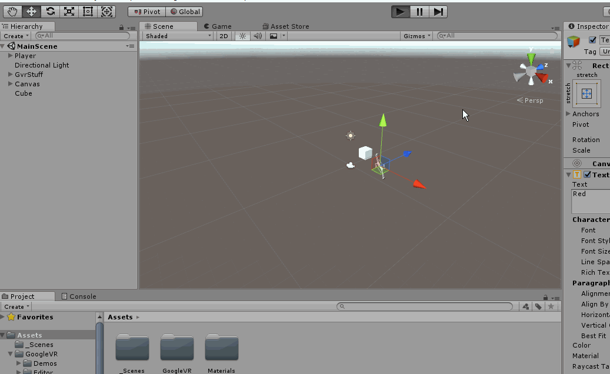

# Create Cardboard Apps in Unity

In this tutorial, we will setup Unity to develop apps for **Google Cardboard** and know some best practices.

This tutorial assumes that you already have some experience in Unity and that you have Android SDK installed.

## Overview

The Unity version used in this tutorial is **2017.3.1f1** and the SDK version is **v1.130.1**. 
We will first download the **Google cardboard SDK** from Github, then set up the **Project Settings**. Finally, we will mention some stuff to take care of in the scene and how to interact with UI elements and 3D objects.

*End result*

## Downloading the SDK

An SDK stands for Software Development Kit. 

"*SDK is typically a set of software development tools that allow the creation of applications for a certain software package*" -[Wikipedia](https://en.wikipedia.org/wiki/Software_development_kit)

To download the SDK:

* Go to google and search for **GVR SDK unity** which is short for *Google Virtual Reality Software Development Kit unity*.
* Open the link that says **Releases**

Or visit directly this link [Google VR SDK Releases](https://github.com/googlevr/gvr-unity-sdk/releases).

*Google Search*

* Download the **.unitypackage** from the latest release or whatever the release you like. The current version when I made this tutorial was **v1.130.1**. It might be different but the concept is the same to download the **.unitypackage**.

*Latest Release and UnityPackage*

## Project Settings

After installing the SDK, it is not automatically imported in all your projects. You need to manually do that for every project you want it in.

Let's get started

* Create a new Unity project and name it whatever you like, I named mine **Cardboard app** with **Analytics** turned off and a **3D** project.

*Unity project*

Import the **Gvr SDK** we downloaded. This can be done in multiple ways:

* Double click the **.unitypackage** file
* Drag and drop the file in the **Assets** folder
* From the upper menu, **Assets**>**Import Package**>**Custom Package..** and browse for the asset you want.

* When asked what to import, click **All** then click **Import** and wait for the loading to finish

*Import*

Before going anything further, make sure that you have your **Android modules** installed when you first installed Unity and that the **Android SDK** and **Java JDK** are installed as well.

* Go to **Edit**>**Preferences** and make sure the**SDK** and **JDK** are available. **NOTE:** The **Android SDK** is different than **GvrSDK** we downloaded. If you don't have it installed, press the **Download** button and follow along. There will be another tutorial in future dedicated for this.

*Preference Settings*

* Now go to the build Settings by pressing **Ctrl + Shift + B** or by going to **File**>**Build Settings**.
* Choose **Android** and Press the **Switch Platform** button at the bottom left corner of the window.

*Switch Platform*

Now go to the **Player Settings**. There are 2 ways:

* From the **Build settings** click on the **Player Settings** button beside the **Switch Button**
* From **Edit**>**ProjectSettings**>**Player**

*Project Settings*

The first thing to modify in the **Player Settings** is the **XR Settings**

* Open the **XR Settings** tab by clicking it
* Enable **Virtual Reality Supported**
* Add the **Cardboard** from the drop down

*Add Cardboard SDK*

* Go to the **Others** tab
* Change the **Package Identifier**. Make sure you press **Enter key** after writing down the name because Unity sometimes doesn't save changes.
* Make the minimum API level 4.4 or higher

*Others Settings*

## Scene Settings
We are now ready to move on into the scenes, but let's first organize our folder.

* Create a new folder named **_Scenes** and save your scene inside it.
* Open **Build Settings** and click on **Add open scene**

*Save scene*

Let's add some important prefabs to be able to test in the editor and interact with UI elements. All the important prefabs are found in **GoogleVR**>**Prefabs**

* **GvrEditorEmulator** which allow for the emulation of the Cardboard in the Editor
* **Cardboard**>**GvrReticlePointer** is the pointer that enables the interaction with the UI system and 3D objects make sure that it's a child to the **MainCamera** and that it's in zero zero zero with no rotations and a scale of 1.
* **Controllers**>**GvrControllerMain** which allow for the cardboard to actually work
* **EventSystem**>**GvrEventSystem**. Make sure there is only one event system in the scene. Delete any before adding the **GvrEventSystem** from the prefabs.

*Prefabs*

There are few things we need to understand before moving on. Every time we run the scene now, we will find that the **Main Camera** resets its transforms whatever it's position is and we can't change it. What if we want to move around? What the GvrSDK does is that it set's the Camera's local position to zero and makes it stay zero. To solve this:

* Create an empty **GameObject**, name it **Player** and place it anywhere you like.
* Make the **Main Camera** a child to it and resets its transform
* Don't move the **Camera** anymore and move the **Player** wherever you like.

To organize stuff for me, I usually create an empty object and name if **GvrStuff** and throw in it the **EventSystem**, **Emulator** and **Controller**.

Your final setting should look like this:

*Final Setting*

Pressing play now, You can rotate around by holding the **Alt** key and interact using the normal mouse click but we have nothing to interact with which is the next step.

## Interacting with UI

Interaction with UI will work like a charm without anything because we already added the **GvrEventSystem** and **GvrReticlePointer**, but let's test it out.

* Create **UI**>**Button**
* Set the **Canvas**'s **Render Mode** to **World Space**
* Set the **Canvas** scale to (0.01, 0.01, 0.01)
* Set the rotation to (0, 30, 0)
* Set Position to (2, 0, 2)
* Set the width to 200 and height to 100
* Set the button position to (0, 0, 0)

You will end up with something like this

*Canvas Setup*

* Go to the canvas and remove the **Graphics Raycaster** component and add the **Gvr Pointer Graphics Raycaster**

*Graphics Raycster*

Let's create a simple cube to test changing its material

* Create a cube and make its position (-1, 0, 3) with no rotation and scale
* Create a material with the Red color for example
* In the OnClick of the button, add an event and drag the Cube
* Choose the **MeshRenderer**
* Select **Material material**
* Drag and drop the **Red** material

*Setup*

Now let's test it

* Press play button
* Hold **Alt key** to move around and click to simulate the **Trigger button**

*Awesome*

## Interacting with 3D Objects
Let's try to interact with the Cube Directly without any button, We will change its material using **EventTriggers**. These are events that triggers when certian action happen like **Pointer up** and **Pointer click**. For more info, see the [documentatio](https://docs.unity3d.com/Manual/script-EventTrigger.html).

To be able to interact with 3D objects we need the **Main Camera** to be able to detect that.

* Go to the **Main Camera** and add a component called **GvrPointerPhysicsRaycaster**

*Gvr Physics Raycster*

* The object you interact with needs to have a **Collider** and an **EventTrigger** components.

The cube by default comes with a collider, let's add an **Evenet Trigger**

* **Add Component** button and write **Event Trigger**
* Press **Add New Event** and select **PointerEnter**.

We are not going to go through all these events. What we will test are:

* **Pointer Enter**: Fires when the pointer is over the 3D object
* **Pointer Exit**: Fires when the pointer leaves the 3D object
* **Pointer Click**: Fires when the Pointer clicks on the 3D object

*Event Trigger*

Just like we did with the button **On Click**, we will duplicate the material 3 times and add 3 different materials to test it.

*Event Trigger Material*

Press play and let's test it.

*Test*

## Build the APK
To build and test it on your Android device,

* Go to the **Build Setting** and click on **Build**
* Create a new folder named **Build** and choose a name for your APK

*Build*

For your information, the name that will appear when you install the app on your phone won't be the APK name. It will be the name set in the **Player Settings**

*APK Name*

## Summary

We downloaded and added the Gvr SDK to our project, configured the project settings and add the needed prefabs in our scene. We also learned how to interact with the UI and 3D objects in our scene and that's it's important to make the Canvas world space and what to add remove and replace for graphics ray casting and physics ray casting to work well.

*Final*

## Reference

* [Google VR SDK Github releases]()
* [Unity Documentation on Event Trigger](https://docs.unity3d.com/Manual/script-EventTrigger.html)

## Social Media
* Connect with me on [LinkedIn](https://www.linkedin.com/in/mohammedalsayedomar/) to stay updated with the upcoming tutorials
* Follow me on [Twitter](https://twitter.com/Mohammed_Omar_U)