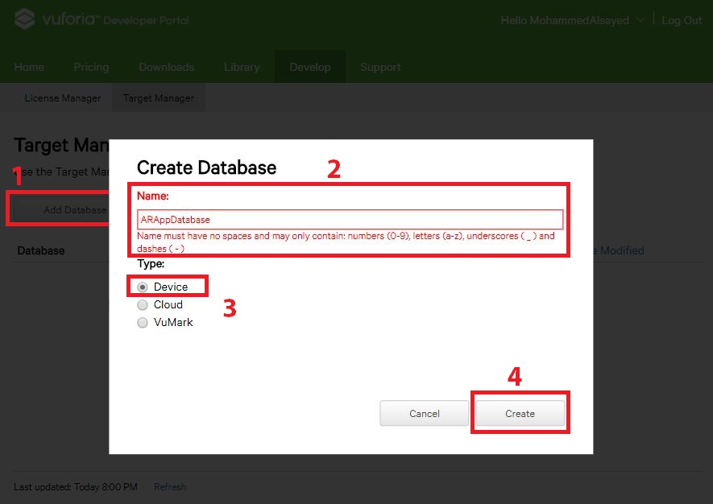

# Vuforia in Unity

In this tutorial, we will cover how to get started with Unity and Vuforia.

## Overview
The Unity version used in this tutorial is **2017.3.1f1**. Just for your info, Vuforia is now integrated with the Unity editor without any external package since **Unity 2017.2** as seen in this [link](https://developer.vuforia.com/forum/news-and-announcements/vuforia-now-unity). We will start first on Vuforia's website, then to Unity to set everything up. Finally, we will build it and test on Android.

## Vuforia Setup

#### Creating an Account on Vuforia
Visit [Vuforia developers website](https://developer.vuforia.com/) and click on Register at the top right corner. If you already have an account **Log In** and skip to the next section.

*Login/Register Vuforia*

The registration is straightforward nothing special. You enter your stuff and press enter. The only different thing is that you to verify your account, you receive **Two** emails. One containing the license agreement which is ignored anyway and one containing the activation link. If you didn't receive the activation link make sure you mail the support team until your account is verified. 

*Registration*
#### Create Application Key
After logging in, you will hopefully have the same screen as this. There are 2 main sections **License Manager** where you manage your apps and get your **License Key** and the **Target Manager** where you manage your **Databases** and add **Image Targets** and so on. By default, the landing screen is the **License Manager**. As you can see I already have an app called **AR Test**.

*Logging In*

Click on **Get Development Key** button to create a new app. Give it a name, check the box where you lie about the terms and conditions unless you really know what you are doing and finally press the **Confirm** button.

*Get Development Key*

You will find your newly creating application there at the top. Click it and copy the license key somewhere as we will use it in Unity.

*License key (I opened two different tabs rather than creating 2 different screenshots)*

#### Creating Database
Now open the **Target Manager**, click on the **Add Database** button, give it a name and select **Device** then finally, click the **Create** button. Make sure that the name you enter doesn't contain spaces or some special characters. For the difference between these 3 choices, check [Vuforia's Documentation](https://library.vuforia.com/articles/Solution/Comparison-of-Device-and-Cloud-Databases.html)

*Creating Database*

Once created, click on the database name then **Add Target** button.
I will be adding this [image](https://goo.gl/images/WUbGeJ) from [Vuforia's Documentation on optimizing target detection]( https://library.vuforia.com/articles/Solution/Optimizing-Target-Detection-and-Tracking-Stability.html) which I recommend to read. The **Width** is just the actual width of the image in real life if you are making something with realistic scale. This can be changed later in Unity so it's ok to write it 1. 

*Add an Image Target*

After adding an image, make sure that it has 5-Stars then download the database from  **Download Database (All)** button. Make sure you choose the **Unity Editor** editor because it's not selected by default.

*Stars and Download Database button*

*Download Dialog*

#### Recap
Right now, you should have 2 things with you. The **license key** and the **.unitypackage** of the database.

## Unity Setup
Create a new project and let's get ready!

*New Unity Project*

#### Project Settings
We will change 2 things:

#### Build Settings

Open the **Build Settings** by pressing **Ctrl + Shift + B** and switch the platform to **Android**. If you can't build for **Android** I recommend checking my other tutorial regarding [Setting up Android SDK and JDK in Unity](https://boostlog.io/@mohammedalsayedomar/setup-android-sdk-and-jdk-in-unity-5adad03d47018500491f3f77)

*Change platform to Android*

#### Player Settings

In the **Others** section change the **Package Name** and disable **Android TV Compatibility** or else you will get some nice build errors.

*Others Setting*

Scroll down to the **XR Settings** and enable **Vuforia Augmented Reality Supported**. You will find a new folder named **Resources** appearing from the middle of nowhere. Don't worry, we will check it in the coming sections.

*XR Setting*
    
#### Scene Settings
We will make few changes:
* Create a new folder for the scenes and save the scene
* Open the **Build Settings** and add the newly saved scene
* Delete the **Main Camera**
* Add the **AR Camera** as if you are creating a simple **Cube**. When asked to import the assets press **Import**.

*Some changes in the Scene*

Next, we will import the **.unitypackage** we downloaded earlier which contains the **Database**

*Import the Database downloaded*

#### Vuforia Settings
To open the **VuforiaConfiguration**, go to the **Resources** folder created and select the only thing inside it and check the **Inspector** window or simply press **Ctrl + Shift + V**.

Now paste the license key you have been keeping for so long. Also, Check both the **Load XX Database** and the **Activate** where **XX** is the name of your downloaded database.

You can check other settings like the **WebCam** to be able to test in the editor without building.

*Vuforia Configuration*

#### More Scene Setting
* Create an **Image Target** from **Vuforia**>**Image**.
* Select the **ImageTarget** and in the **Image Target Behavior (Script)** change the **Database** to the one you downloaded. 

*More scene settings*

Now anything child to this **ImageTarget** will appear once the camera detects the target when you build.

Let's add a cube for example. This cube can be replaced with anything you want. For the purpose of illustration, let's leave it as a cube.

Add a cube and make it child to the Image Target object.
After that,
Change the Transform component as follow
* Position (0, 0.2, 0)
* Rotation (0, 0, 0)
* Scale (0.3, 0.3, 0.3)

*Add Cube*

## Build the APK
Simply, Go to the **Build Settings** and press **Build**.

*Build*

## Summary
We created an account, app license, and a database. Then we configured Unity and imported Vuforia. Finally, we added the image target and everything that's child to it will move with the target like the cube we added.

*Screenshot from the app*

## Reference
* [Vuforia Developer Portal](https://developer.vuforia.com/)
* [Vuforia's Documentation - Comparison between Database types](https://library.vuforia.com/articles/Solution/Comparison-of-Device-and-Cloud-Databases.html)
* [Vuforia's Documentation - Optimizing Target Detection]( https://library.vuforia.com/articles/Solution/Optimizing-Target-Detection-and-Tracking-Stability.html)
* [Setting up Android SDK and JDK in Unity](https://boostlog.io/@mohammedalsayedomar/setup-android-sdk-and-jdk-in-unity-5adad03d47018500491f3f77)

## Social Media
* Connect with me on [LinkedIn](https://www.linkedin.com/in/mohammedalsayedomar/) to stay updated with the upcoming tutorials
* Follow me on [Twitter](https://twitter.com/Mohammed_Omar_U)