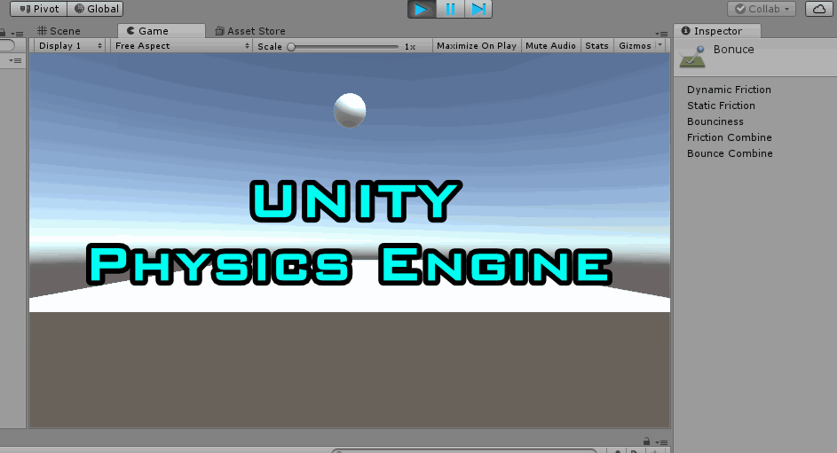

# Unity Physics Engine



In this tutorial, we will cover how to get started with Unity's physics engine.

## Overview
The Unity version used in this tutorial is **2017.3.1f1**. Most of what we are going to cover apply to the previous versions as well. So it's safe to follow. We will first talk about the physics and how objects collide, then we will use MonoBehavior built-in messages that fires when objects collide to do certain events. We will also talk about triggers and their events.

## Physics
To be able to use Unity's physics behavior, we just add a component called **Rigidbody** to the game object we want.

#### Rigidbodies
Create a new project. Add a cube as a floor and name it **Ground** 
* Set it's position to (0, 0, 0)
* Set it's rotation to (0, 0, 0)
* Set it's scale to (10, 0.2, 10)

Now create a **Sphere** and name it **Ball**. 
* Set it's position to (0, 5, 0)
* Set it's rotation to (0, 0, 0)
* Set it's scale to (1, 1, 1)


*Scene Setup*

If we pressed the play button now, nothing will happen. Let's try adding the **Rigidbody** component to the ball.


*Adding Rigidbody*

Let's discuss what are these values in the rigidbody we added.
* **Mass**: mass in kilograms if you assumed that 1 unity unit is equivalent to 1 meter
* **Drag**: it's like air resistance when moving the object
* **Angular Drag**: air resistance too but for rotation
* **Use gravity** is self explanatory
* **Is Kinematic**: One of the most important parameters in a rigidbody. When enabled, the object isn't driven by the physics engine anymore but it can be moved and animated. It is used to create complex behaviors combined with joints but we won't cover it here. 

For more information about rigidbodies, I recommend checking the documentation, or pressing the book icon beside the cog gear which will open up the [documentation link](https://docs.unity3d.com/Manual/class-Rigidbody.html)


*Rigidbody*

To change the default gravity values, Go to **Edit>Project Settings>Physics** and you will find the **Gravity** set to the default of -9.81.

Be careful that this value will affect the gravity in the whole project. So don't change it unless you know what you are doing.


*Gravity*

If we pressed play now, the ball will fall down till it hit the ground.


The ball fell down because of the rigidbody, but what made it stop is the collider that is on the sphere and the cube we created.

#### Physics Materials
What if we want the ball to bounce back when it hits the ground?

To answer this, we need to know what made the ball stop when it hit the ground. It's the collider. Let's check it's parameters.
* Edit Collider is a button that allows you to edit **Center** and **Radius** in the **Scene view** without entering numbers.
* **Is Trigger** will have its own section below
* **Material**: This is not the color or texture material we discussed before. The box says **None (Physics Material)** which states that the type is physics material.
* **Center** and **Radius** are self explanatory.


*Collider*

To create and assign a new **Physics Material**
* Right click on an empty area in the **Project** tab
* **Create**>**Physics Material**
* Name it anything. I named my material **Bounce**

*Creating Physics Material*

* Change Bounciness to 1


*Change Bounciness to 1*

* Drag and drop the **Bounce** in the collider's **Material** empty slot

*Assign physics material*

For more info on physics material, read the documentation in this [link](https://docs.unity3d.com/Manual/class-PhysicMaterial.html)

* Press the **Play** button and enjoy

*Bouncing ball*

The ball doesn't continuously bounce because of the **Bounce Combine** parameter which was set to **Average**. Since the collider of the ground doesn't have any bounciness, the ball takes the average which is half the original because it's 1 (ball) + 0 (ground). Setting it to maximum will always be 1 which will make the ball bounce back to its position. I recommend checking the [documentation](https://docs.unity3d.com/Manual/class-PhysicMaterial.html) for more info.


*Bounce Combine*

Press **Play** now and enjoy the bouncing ball


*Bouncing ball*

#### Collision Matrix

To know what collides with what, we need to check the collision matrix that's in the [Unity's documentation](https://docs.unity3d.com/Manual/CollidersOverview.html).

As we can see, no 2 static objects collide with each other and a Rigidbody can collide with anything. So, whenever things don't collide and you don't know what's happening, check the collision matrix.


*Collision matrix*

#### OnCollisionEnter
There are some Unity messages that fires automatically when specific actions happen. These messages can be used in conjunction with tags and layers to create unique experiences or gameplay. The message or event that fires when a collision happens is called **OnCollisionEnter(..)**.

There are some constraints, the script containing this function must reside on a game object that has a collider, otherwise, your code won't run because no collider fired the event.

To get started, create a new script. I named mine **CollisionDetectionTest.cs**

Rather than memorizing all Unity's events with their parameters, there are some easy ways which I highly recommend.

Open the script in **Visual Studio** and **Right Click** in an empty area.
* If you are new, I recommend **Implement MonoBehaviors** which shortcuts to **Ctrl+Shift+M**.

*Right click menu*
* This brings up all Unity messages/ events that are available and at the bottom, it tells how many are implemented.

*Implement MonoBehavior. The 2 implemented are Start and Update*

* The other onc below the first option is **Quick MonoBehaviors** or simply **Ctrl+Shift+Q** auto completes for you. By simply typing "OnCol", it showed me all possible events to implement.

    

*Quick MonoBehavior*

* Select the **OnCollisionEnter(Collision)** option and you will find it added to your functions.

I am sure you have noticed 3 different messages
* OnCollisionEnter: fires only once when there is a collision
* OnCollisionExit: fires only once when the collision exists
* OnCollisionStay: keeps on firing as long as there is a collision

Check the [documentation](https://docs.unity3d.com/ScriptReference/Collider.html) for more info

To test this out:
* write this line of code inside the function
```
public void OnCollisionEnter(Collision collision)
{
    Debug.Log("Collision Entered");
}
```
This simply prints "Collision Entered" in the console when collision happens


*OnCollisionEnter function*

* Save the script and drag and drop it on the Ball game object.


*Add script to the Ball*

* Open the **Console** window and press **Play** notice the log in the console


*Console printing*


## Triggers
Collision is great, but what if we want the objects to pass through each other and still get a function called. For example, checkpoints in racing games, or certain action to happen only when player enters an area. If they were normal colliders, then the car won't be able to pass through the checkpoint.

Marking the collider as a trigger makes it fire different events but the same concept as the OnCollision functions.


*Trigger checkbox*

#### Collision Matrix
Similar to the collision matrix, there is a matrix for triggers which is available in the same [link](https://docs.unity3d.com/Manual/CollidersOverview.html).


*Trigger Collision Matrix*

#### OnTriggerEnter

The 3 events available are exactly the same except for the parameter is **Collider** not **Collision**:
* **OnTriggerEnter**: fires only once when something enters the trigger. For example, enabling spooky music when a player enters a region.
* **OnTriggerStay**: keeps on firing as long as the collider is inside the trigger. For example, spawning monsters and makes them follow the player as long as he stays inside the collider
* **OnTriggerExit**: fires only once when the collider exits the trigger collider. For example, disabling this spooky music and killing all monsters that are following the player.


*Quick MonoBehaviors*

## Summary
We understood how to make physics work and the difference between collision and triggers. We also knew the events that Unity uses to and where to make write our unique behaviors when colliding with an object for example.

## Reference
* [Unity's Documentation on Rigidbodies](https://docs.unity3d.com/Manual/class-Rigidbody.html)
* [Unity's Documentation on Physics Materials](https://docs.unity3d.com/Manual/class-PhysicMaterial.html)
* [Unity's documentation on Collision Overview for **Collision Matrix**](https://docs.unity3d.com/Manual/CollidersOverview.html).


## Social Media
* Connect with me on [LinkedIn](https://www.linkedin.com/in/mohammedalsayedomar/) to stay updated with the upcoming tutorials
* Follow me on [Twitter](https://twitter.com/Mohammed_Omar_U)